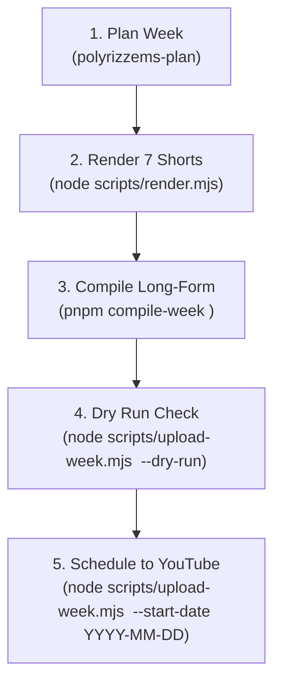

# POLYRIZZEMS YouTube Uploader (`polyrizzems-upload`)

Automates uploading and scheduling all 7 daily YouTube Shorts and the weekly long-form masterclass compilation video directly to YouTube with complete metadata (declarative titles, descriptions, hashtags, category: Music, and scheduled release dates).

---

## 1. Quick Start Commands

```bash
# 1. Show Visual Status Dashboard across all planned weeks:
node apps/music/poly-rizzems/scripts/upload-week.mjs status

# 2. Automatically detect and preview the NEXT pending batch (0 API units):
node apps/music/poly-rizzems/scripts/upload-week.mjs next --dry-run

# 3. Automatically upload and schedule the NEXT pending batch:
node apps/music/poly-rizzems/scripts/upload-week.mjs next -y

# 4. Sync/reconcile upload history with the YouTube channel:
node apps/music/poly-rizzems/scripts/upload-week.mjs sync

# 5. Manual Batch Upload (specific week, explicit date, custom days):
# Batch 1 (Day 1): Upload Main Masterclass Video + Days 1–4 Shorts (8,000 units)
node apps/music/poly-rizzems/scripts/upload-week.mjs 3 --start-date 2026-08-24 --days 1-4 --compilation -y

# Batch 2 (Day 2): Upload Days 5–7 Shorts (4,800 units)
node apps/music/poly-rizzems/scripts/upload-week.mjs 3 --start-date 2026-08-24 --days 5-7 --no-compilation -y
```

---

## 2. One-Time Google Cloud OAuth 2.0 Setup

To allow the upload script to talk to your YouTube channel:

### Step 1: Create a Google Cloud Project & Enable YouTube API
1. Go to [Google Cloud Console](https://console.cloud.google.com/).
2. Create a new project (e.g. `Polyrizzems Automation`).
3. In the search bar at the top, search for **YouTube Data API v3** and click **Enable**.

### Step 2: Configure OAuth Consent Screen
1. Navigate to **APIs & Services** > **OAuth consent screen**.
2. Select **External** (or Internal if using Google Workspace).
3. Set App Name: `POLYRIZZEMS Uploader`, User Support Email: your email.
4. Under **Scopes**, click **Add or Remove Scopes** and add:
   - `https://www.googleapis.com/auth/youtube.upload`
   - `https://www.googleapis.com/auth/youtube`
5. Under **Test Users**, add your YouTube channel's Google email address.
6. Save and finish.

### Step 3: Create Desktop Client Credentials
1. Navigate to **APIs & Services** > **Credentials**.
2. Click **Create Credentials** > **OAuth client ID**.
3. Application Type: **Desktop App** (or Web Application with redirect URI `http://localhost:3333/oauth2callback`).
4. Click **Create**.
5. Download the JSON credential file and save it as:
   `apps/music/poly-rizzems/client_secret.json`

### Step 4: First-Time Login
Run any upload command (or `node apps/music/poly-rizzems/scripts/upload-week.mjs 2 --start-date 2026-09-01`).
- The script will open your browser to log in with Google.
- Grant permission to the app.
- The refresh token is saved securely to `apps/music/poly-rizzems/.youtube-token.json` (gitignored). Future runs are 100% automated and headless.

---

## 3. Google Quota Extension Form Guide (Free)

By default, Google Cloud grants **10,000 units/day**.
- Each video upload costs **1,600 units**.
- 8 weekly videos (7 Shorts + 1 Compilation) = **12,800 units**.
- You can either split uploads across 2 batches, or request a free quota bump to **50,000 units/day**.

### How to request a quota increase:
1. Go to [YouTube Data API Quota Extension Request Form](https://support.google.com/youtube/contact/yt_api_form).
2. Fill in the form fields using this template:

| Form Field | Suggested Response |
| :--- | :--- |
| **Project Number / ID** | Your Google Cloud Project Number (found on Cloud Console Dashboard) |
| **Type of Application** | Internal / Personal Content Automation & Creator Scheduling Tool |
| **Requested Quota** | `50,000` units/day |
| **Description of Project** | Internal automation script for the POLYRIZZEMS educational music theory YouTube channel. The tool automates publishing scheduled daily educational music shorts and a weekly compiled masterclass video rendered from open-source web synthesizers. |
| **Why is additional quota needed?** | Each weekly cycle uploads 7 vertical shorts (1,600 units each) and 1 compiled recap video (1,600 units), requiring 12,800 units per weekly batch upload. A quota of 50,000 units/day allows weekly scheduling without batch splitting. |
| **API Methods Used** | `youtube.videos.insert` |
| **Commercial / Third-Party Use?** | No, single-channel creator tool. |

Google typically approves creator automation quota increases within 24–48 hours for free.

---

## 4. End-to-End Weekly Publishing Pipeline

Follow these steps for each campaign week:



### 1. Render all 7 Shorts (Vertical 9:16)
```bash
# In apps/music/poly-rizzems:
node scripts/render.mjs --spec week2-day1-3vs4
node scripts/render.mjs --spec week2-day2-2vs3
# ... or render all days for the week
```

### 2. Compile the 7-in-1 Long-Form Video (Landscape 16:9)
```bash
node scripts/compile-week.mjs week-2-fast-basics
```

### 3. Dry Run Schedule Verification
```bash
node scripts/upload-week.mjs week-2-fast-basics --start-date 2026-09-01 --dry-run
```

### 4. Upload and Schedule
```bash
node scripts/upload-week.mjs week-2-fast-basics --start-date 2026-09-01 --time 17:00
```
